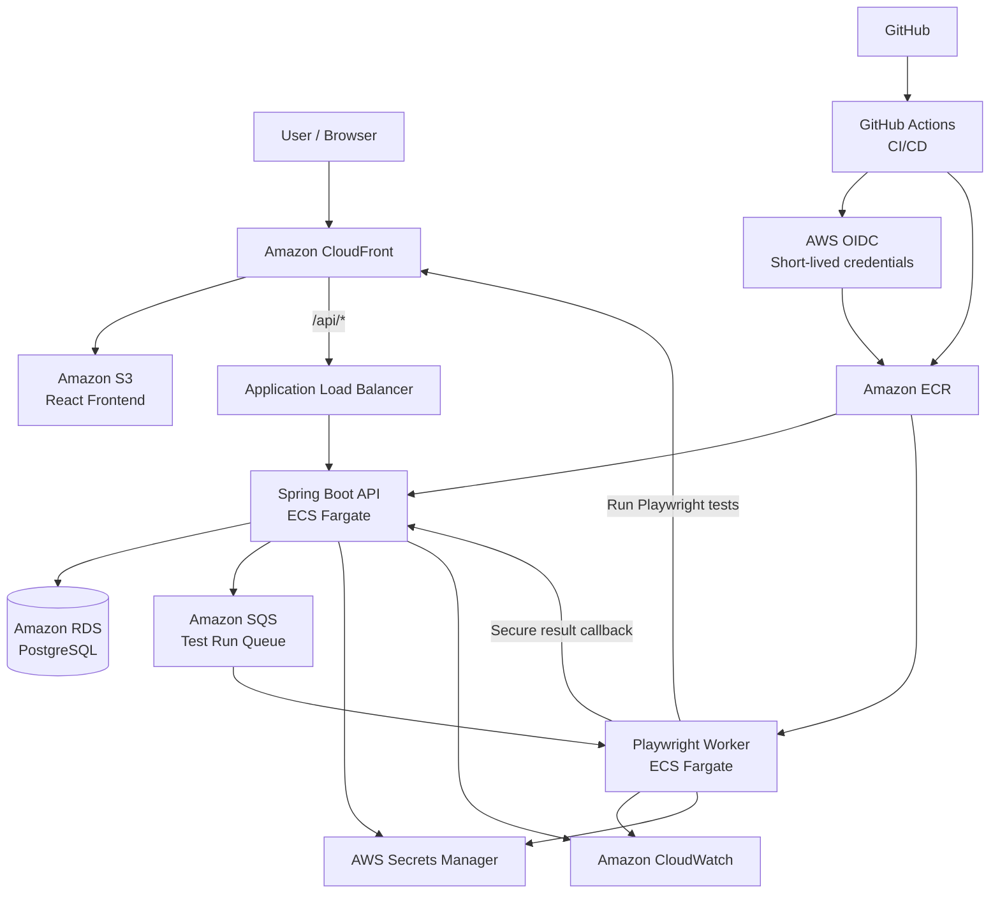

# QACloud

A cloud-native QA and test management platform that combines test-case management, automated Playwright execution, distributed test processing, defect tracking, and CI/CD on AWS.

**Live application:** https://d3bvghtni8eea9.cloudfront.net

## Overview

QACloud demonstrates a production-style quality engineering workflow:

1. A user manages QA projects, test suites, test cases, runs, and defects.
2. The React frontend sends requests to a Spring Boot API running on AWS ECS/Fargate.
3. Starting a test run creates a job in Amazon SQS.
4. A separate Dockerized Playwright worker running on ECS/Fargate long-polls the queue.
5. The worker executes real browser tests against the deployed QACloud application.
6. Individual results are securely reported back to the API.
7. Results are stored in PostgreSQL on Amazon RDS and displayed in the QACloud dashboard.

A successful production run executes completely in AWS without requiring a local computer or test runner.

## Architecture



## Key Features

- Project, test-suite, and test-case management
- Automated Playwright end-to-end testing
- Asynchronous test execution through Amazon SQS
- Dockerized Playwright worker running on ECS/Fargate
- Individual pass/fail test-result reporting
- Defect tracking with severity and status
- QA dashboard with aggregate statistics and run history
- JWT-based authentication
- Secure internal worker callback authentication
- PostgreSQL persistence with Spring Data JPA / Hibernate
- CloudWatch application and worker logging
- Secrets stored in AWS Secrets Manager
- Infrastructure managed with Terraform
- GitHub Actions CI/CD using AWS OIDC
- Separate API and worker ECR repositories
- Separate ECS task roles for API and worker responsibilities

## End-to-End Test Flow

```text
User clicks "Run tests"
        ↓
Spring Boot creates a test run
        ↓
Job is published to Amazon SQS
        ↓
Playwright ECS worker receives the job
        ↓
Playwright executes real browser tests
        ↓
Worker matches Playwright results to QACloud test cases
        ↓
Worker reports individual results to the secure callback API
        ↓
Spring Boot stores results in PostgreSQL
        ↓
QACloud dashboard displays PASSED / FAILED results
```

The SQS message is deleted only after the run has been successfully processed and reported back to QACloud. If processing fails, the message is not deleted and becomes available again after the SQS visibility timeout, providing basic retry behavior.

## Technology Stack

### Frontend
- React
- TypeScript
- Vite

### Backend
- Java 21
- Spring Boot
- Spring Security
- Spring Data JPA
- Hibernate
- Maven

### Testing
- Playwright
- JUnit 5
- Mockito
- Testcontainers

### Data
- PostgreSQL
- Amazon RDS

### AWS
- Amazon ECS / Fargate
- Amazon Elastic Container Registry (ECR)
- Amazon Simple Queue Service (SQS)
- Amazon RDS
- Amazon S3
- Amazon CloudFront
- Application Load Balancer
- AWS Secrets Manager
- Amazon CloudWatch
- AWS IAM

### DevOps
- Docker
- Terraform
- GitHub Actions
- GitHub → AWS OIDC

## AWS Architecture

QACloud uses separate workloads for the API and automated test worker.

### API Service

The Spring Boot API runs as an ECS/Fargate service behind an Application Load Balancer.

Responsibilities include:

- Authentication
- Project management
- Test-suite and test-case management
- Test-run creation
- SQS job publishing
- Result persistence
- Defect management
- Dashboard data
- Secure worker callback endpoints

### Worker Service

The Playwright worker runs as a separate ECS/Fargate service.

Responsibilities include:

- Long-polling Amazon SQS
- Receiving queued test-run jobs
- Executing Playwright tests
- Matching automated tests to QACloud test cases
- Reporting individual results back to the API
- Completing the run
- Deleting the SQS message only after successful processing

The worker has no inbound network requirement.

## CI/CD

QACloud uses GitHub Actions for production deployment.

The deployment workflow:

1. Checks out the repository.
2. Authenticates to AWS using GitHub OIDC.
3. Builds and tests the application.
4. Builds the Spring Boot API Docker image.
5. Pushes the API image to Amazon ECR.
6. Redeploys the API ECS service.
7. Builds the Playwright worker Docker image.
8. Pushes the worker image to its own ECR repository.
9. Redeploys the worker ECS service.
10. Builds the React frontend.
11. Publishes the frontend to Amazon S3.
12. Uses CloudFront for production delivery.
13. Waits for ECS services to reach a stable state.

No long-lived AWS access keys are stored in GitHub Actions.

## Security Design

QACloud applies several production-style security practices:

- GitHub Actions uses AWS OIDC instead of permanent AWS credentials.
- API and worker containers use separate ECS task roles.
- IAM permissions follow least-privilege principles.
- The API can publish jobs to SQS.
- The worker can receive and delete SQS messages.
- The worker does not use developer AWS credentials in production.
- Database, JWT, and worker secrets are stored in AWS Secrets Manager.
- Internal worker callback endpoints require a dedicated `X-Worker-Token`.
- The worker requires no inbound network access.
- CloudFront routes `/api/*` separately from frontend SPA routes.
- A CloudFront Function rewrites only frontend routes, preventing API errors from being returned as `index.html`.

## Reliability

QACloud uses an asynchronous SQS-based execution model.

The API does not block while browser tests run. Instead, it creates a test run and publishes a job to SQS.

If the worker cannot complete processing successfully, the SQS message is not deleted and becomes available again after the visibility timeout. This provides basic retry behavior while keeping test execution independent from API availability.

## Observability

QACloud uses Amazon CloudWatch for API and worker logs.

Worker logs include:

- SQS message receipt
- Run ID and project ID
- Playwright execution start
- Pass/fail result mapping
- Callback completion
- SQS message deletion

This makes it possible to trace a test run from queue receipt through completion.

## Infrastructure as Code

Terraform manages the major AWS infrastructure used by QACloud, including:

- VPC and networking
- ECS cluster and services
- API and worker task definitions
- IAM roles and policies
- Security groups
- RDS PostgreSQL
- Amazon SQS
- API and worker ECR repositories
- Amazon S3
- CloudFront
- CloudFront SPA rewrite function
- AWS Secrets Manager
- CloudWatch log groups

Terraform state is stored remotely and is not committed to the repository.

## Production Validation

The production workflow has been verified end-to-end:

```text
QACloud UI
   ↓
Spring Boot API on ECS/Fargate
   ↓
Amazon SQS
   ↓
Playwright Worker on ECS/Fargate
   ↓
Real browser tests
   ↓
Secure result callback
   ↓
PostgreSQL on Amazon RDS
   ↓
QACloud dashboard
```

Verified production runs have completed with:

```text
PASSED — 2/2 automated Playwright tests
```

No local worker or developer machine is required for production execution.

## Automated Test Cases

The production automated suite currently includes:

- `demo user can sign in and view the dashboard`
- `user can navigate to a project and see test management controls`

These cases are mapped to real Playwright test titles so worker results can be associated with QACloud test-case records.

## Local Development

### Requirements

- Git
- JDK 21
- Maven
- Node.js
- Docker Desktop

### Backend

```bash
cd backend
mvn test
```

### Frontend

```bash
cd frontend
npm install
npm run build
```

### Playwright Tests

```bash
cd test-runner
npm install
npx playwright install
npm test
```

### Local Worker

```bash
cd test-runner
npm run worker
```

The production worker normally runs continuously as a Docker container on AWS ECS/Fargate.

## Docker Worker

The Playwright worker is built from:

```text
test-runner/Dockerfile
```

The worker image is stored in the `qa-cloud-platform-worker` Amazon ECR repository and deployed to the `qa-cloud-platform-worker` ECS service.

## Repository Structure

```text
qa-cloud-platform/
├── backend/
│   ├── src/
│   ├── pom.xml
│   └── ...
├── frontend/
│   ├── src/
│   ├── package.json
│   └── ...
├── test-runner/
│   ├── tests/
│   ├── worker.mjs
│   ├── Dockerfile
│   ├── playwright.config.ts
│   └── package.json
├── infrastructure/
│   └── terraform/
│       ├── main.tf
│       └── ...
├── .github/
│   └── workflows/
│       ├── deploy.yml
│       └── ...
└── README.md
```

## Engineering Concepts Demonstrated

This project demonstrates:

- Full-stack application development
- REST API design
- Object-oriented Java development
- Relational database design
- Authentication and authorization
- Automated unit testing
- Automated end-to-end testing
- Message-driven architecture
- Distributed worker processing
- Asynchronous job execution
- Docker containerization
- AWS ECS/Fargate deployment
- Infrastructure as Code
- IAM least privilege
- Secret management
- Cloud networking
- CloudFront routing
- CI/CD
- GitHub OIDC
- Production logging and observability
- Retry behavior and failure recovery
- Real production debugging

## Current Status

The complete production workflow is operational:

```text
React / CloudFront
        ↓
Spring Boot / ECS Fargate
        ↓
Amazon SQS
        ↓
Playwright Worker / ECS Fargate
        ↓
Secure API Callback
        ↓
PostgreSQL / RDS
        ↓
QACloud Dashboard
```

QACloud is deployed on AWS and automated test runs can execute entirely in the cloud.

## Future Improvements

Potential next improvements include:

- More Playwright test coverage
- Run-detail pages with individual result drill-down
- Test-case editing in the frontend
- Automated defect creation from failed test results
- Dead-letter queue support for repeatedly failing SQS jobs
- Worker autoscaling based on SQS queue depth
- Additional CloudWatch alarms and dashboards
- Custom domain and HTTPS certificate
- Role-based application permissions
- Historical test analytics and trend charts

## Author

**Swacha Mallik**

Computer Science student at Memorial University of Newfoundland.

GitHub: https://github.com/Swacha023  
LinkedIn: https://www.linkedin.com/in/SwachaMallik
